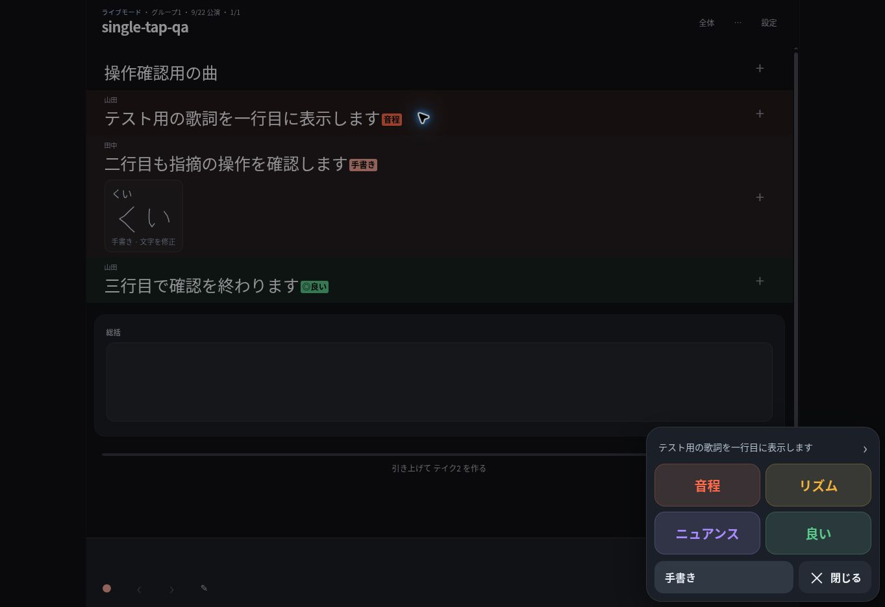

# v16.36 handwriting trial

The primary note palette now has four fixed buttons: 音程, リズム, ニュアンス, 良い. Each immediately saves the lyric selection. Other instructions can be handwritten, one character per cell. Original strokes are saved before recognition, and recognition never replaces them. Text is marked unreviewed until manually saved.

Verification on 2026-09-22:

- All 58 automated tests pass, including save-before-recognition, stale result/deletion/manual-edit protection, vector normalization, backup/publication retention and the actual bundled recognizer.
- Cloud Chrome, fictional `single-tap-qa` Excel: a single 音程 press saved and closed the dialog. Handwriting saved without waiting for recognition. Another 良い note could immediately be entered. Editing the recognized text and reloading retained both text and original strokes.
- The four primary buttons measured 163 × 66 CSS pixels at the available 1363 × 936 viewport; handwriting and close controls measured at least 50 pixels high.
- The browser check caught a remaining reference to the retired swipe handler. The follow-up removes that dependency, preserves follow-up click suppression, and extends the lyric gesture regression to open a real sheet state.
- No `setlist.json` changes.

Recognition is experimental: the independently drawn kana fixture reads `くい`, but an actual pointer drawing of `くい` was read as `しい`. The original remained visible and correcting it worked. A rough handwritten kanji sample also did not read correctly. This version does not claim reliable arbitrary Japanese handwriting or cursive sentence recognition. Small kana and punctuation may need correction. iPhone Safari, real finger/stylus usability and offline use have not been verified in this cloud browser.

